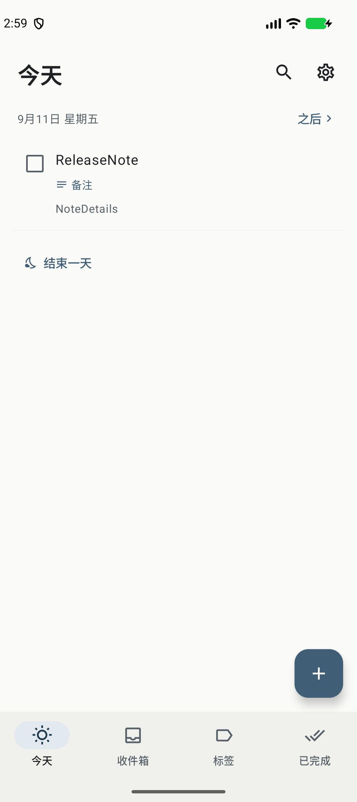
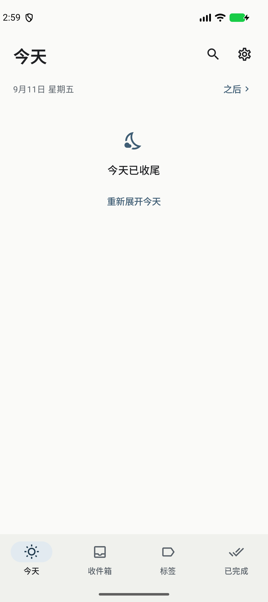

<p align="center">
  
</p>

<h1 align="center">todo</h1>

<p align="center">一个轻量、完全离线的 Android 待办应用。</p>
<p align="center">Kotlin · Jetpack Compose · Android 10+</p>
<p align="center">
  <a href="https://github.com/shihuaidexianyu/todo/releases/latest">下载最新版</a> ·
  <a href="docs/release.md">更新说明</a>
</p>

## ✨ 功能

- **今天与之后**：区分安排日期和截止日期，查看今天要做的事与未来任务。
- **快速记录**：收件箱随手记，创建时一键设为今天截止，保存后直接回到列表。
- **标签整理**：多标签分类，在当前页面展开标签下的任务。
- **任务信息**：行内显示日期、提醒和标签；有备注时显示标记与一行预览。
- **结束一天**：收起今天的列表，随时点击“重新展开今天”恢复。任务、日期与提醒保持原样；次日自动恢复显示。
- **搜索与已完成**：查找任务，从底部导航直接查看完成记录，点击勾选框恢复任务。
- **本地提醒与备份**：系统通知提醒，JSON 导出与恢复；无需账号，应用不申请网络权限。
- **完成反馈**：完成与恢复不弹提示条；勾选后淡出、列表平滑补位；可选轻微震动与清脆短音，静音或勿扰时不播放提示音。
- **外观**：浅色、深色与跟随系统，支持减少动画。

## 📱 预览

<p align="center">
  
  
</p>

截图来自 1.1.2 release 模拟器测试；新安装不含示例任务。

## 📦 安装

在 [Releases](https://github.com/shihuaidexianyu/todo/releases/latest) 下载 `todo-1.1.2-release.apk`，在 Android 10 或以上设备安装。AAB 用于分发构建，手机安装请选择 APK。

当前版本 **1.1.2**（versionCode **5**），沿用此前 release 签名，可覆盖升级。Debug 版签名不同，迁移前请先在设置中导出备份。

## 🧱 技术栈

| 部分 | 实现 |
|---|---|
| 语言与界面 | Kotlin 2.2.20、Jetpack Compose、Material 3 |
| 数据 | Room 2.7.1、SQLite、Flow |
| 提醒 | Android AlarmManager |
| 构建 | Gradle 9.3.1、AGP 9.1.0、JDK 17+ |
| Android | minSdk 29、compileSdk / targetSdk 36 |
| 包名 | `app.todo.local` |

## 🚀 构建与测试

安装 JDK 17+、Android SDK Platform 36 和 Build Tools 36.0.0，配置 `JAVA_HOME`、`ANDROID_HOME`，或使用 Android Studio 打开项目。

```powershell
# 调试构建、单元测试与 Lint
.\scripts\build.ps1

# Release APK / AAB、单元测试与签名校验
.\scripts\build-release.ps1

# 设备测试，需要专用模拟器或测试设备
.\gradlew.bat connectedDebugAndroidTest
```

其他系统可使用 `./gradlew assembleDebug testDebugUnitTest lintDebug`。Release 签名配置及输出位置见 [构建说明](docs/build.md)。设备测试会清空测试安装的数据，并调整本应用的提醒权限，请使用专用测试环境。

1.1.2 已通过 28 项单元测试、3 项针对性界面工作流测试及 release 安装回归；Lint 无错误。覆盖范围见 [验证记录](docs/verification.md)。

## 🗂️ 代码结构

```text
app/src/main/java/app/todo/local/
├── MainActivity.kt    页面、列表与导航
├── Forms.kt           任务编辑与设置
├── TodoViewModel.kt   状态与操作编排
├── Data.kt            数据库与日期规则
├── Reminders.kt       提醒调度与恢复
├── Backup.kt          JSON 备份与导入校验
└── Motion.kt          动画设置
```

[产品规格](todo-product-spec.md) · [UI 设计记录](docs/ui-research/design-notes.md)。原规格中的日终改期流程已由 1.1.2 的“仅收起今天”交互替代。
