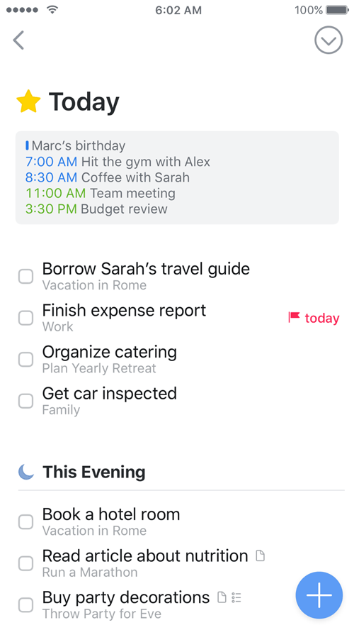
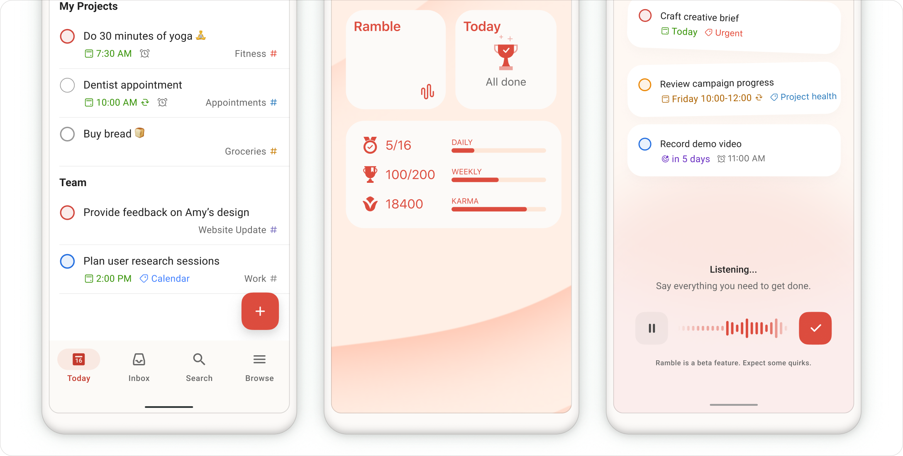
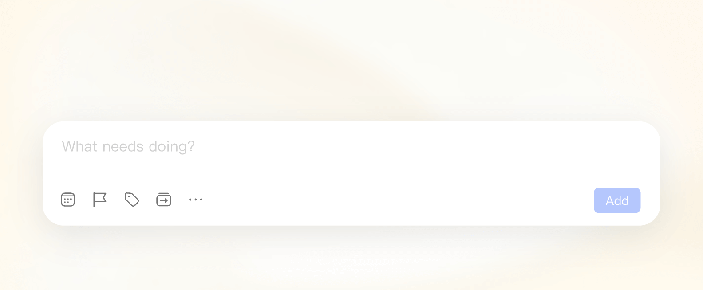

# todo 界面调研与改版行动方案

[查看第一轮 A/B 高保真方向稿](design-comparison.html) · [设计稿说明](design-notes.md)

最新交互约定：右上角直达设置；结束一天仅隐藏今天列表并允许重新展开；任务行展示备注标记与预览。以下旧收尾方案由此约定替代。

视觉方向现已确认采用 A。[进入 A 方向交互原型](prototype-a.html)，后续原生实现沿用该方向。

## 结论

当前界面的主要问题是视觉优先级、信息组织和交互形态没有形成统一语言。页面同时呈现很多默认控件，每个控件都很清楚，但任务内容没有成为稳定的视觉中心。单独缩小间距、更换颜色或补动画，无法修复这种整体感。

建议采用“克制精致、轻盈直接”的方向：保留本地待办的简单结构，以紧凑页头、清晰任务排版、低干扰元信息和轻量输入面板建立辨识度。先交付关键页面的同数据高保真方案和可点击原型，再进入 Compose 实现；审美验收应独立于功能测试。

本报告的观察基于 1.0.1 最终 release 截图、同轮 debug 工作流截图、当前源码和原产品规格。外部资料检索截至 2026-09-11。竞品分析使用官方页面、公开图片与说明，未对竞品安装包做真机体验；截图不能证明动画质量或操作速度。具体字号、尺寸和时长均为本项目的设计提案，不是研究已经证明的最优值。

## 一、现状诊断

### 1. 今天页：任务之前有太多界面

页头先显示“今天”，接着是日期和任务数，再下一行是“结束一天／之后”，然后列表又出现一个“今天”分组。对于一个主要用于看任务的页面，视线需要经过四个层次才能抵达第一条任务。截图里任务少，底部空白很明显；但真正应处理的是上方的重复和任务区内部节奏，而非为了填满屏幕加入装饰内容。

“结束一天”是阶段性动作，却长期占据页头醒目位置；“今天完成 0 项”作为无内容折叠项仍然占一行。页面标题、分组标题和元信息重复交代同一个时间语境。代码也印证了这种结构：页头单独组织日期和操作，列表再次按今天分组，每条任务再显示“安排 今天”。[本地源码](../../app/src/main/java/app/todo/local/MainActivity.kt)

**判断：**留白没有围绕阅读顺序组织起来。应先减少重复信息和低频操作的常驻面积，再细调行距。不能把稀疏任务数量造成的自然空白误判成必须填充的缺陷。

### 2. 新建任务：控件比输入内容更抢眼

大标题“添加任务”、带浮动标签和强调边框的输入框、两行日期和标签控件、大面积保存按钮，各自都要求注意力。它们组合后更接近填写表单，而不是快速记下一件事。边框密度和空白密度同时偏高，因此会出现“很空，但又有点繁琐”的感受。

“今天截止”选中后，旁边仍出现“截止：今天”；展开高级区域还会出现完整截止字段。一项日期状态有多个表达位置。标签名称直接连接到一个 Chip 的文字里，标签多、名称长时，会让输入区域的宽高不可预测。[编辑面板源码](../../app/src/main/java/app/todo/local/Forms.kt)

**判断：**新建流程需要一套有主次的输入结构。标题是内容主体，安排和截止是辅助决策，标签和备注按需展开。当天截止快捷能力应保留，但必须融入日期控件，而非继续叠加入口。

### 3. 标签：已完成原地展开，视觉归属仍弱

目前功能上已支持当页展开，但“全部待办／无标签／自定义标签”呈现得过于相似。展开的任务与标签标题之间缺少稳定的缩进或共同区域，右侧同时有数量、展开箭头和管理按钮，行尾比较拥挤。

这张图来自最终任务元信息横向排版调整之前的 debug 工作流；其中多行元信息的高度不代表最终 release。能够确认的是标签的分组关系和行尾操作组织问题，不能用这张图去否定最终 release 已做的横向换行优化。

**判断：**标签页需要在视觉上明确“系统汇总”和“我的标签”，让展开内容属于对应标签。改为原地展开只是完成了交互规则，还没有完成展开状态的设计。

### 4. 搜索：有输入框，缺少完整的查找体验

搜索框的重边框和大圆角成为页面视觉中心，右侧仍保留与当前查找关系较弱的全局更多菜单。“待办”和“包含已完成”混用了集合名称与开关描述，作为一组选项语义不够平行。

关键词匹配到备注时，结果只显示任务标题和通用元信息，缺少命中片段；匹配到标签时，也没有明确告诉人为什么出现这条结果。现有标签快捷词实际是文本查询，不是精确标签筛选，两者在设计上应区分。[搜索实现](../../app/src/main/java/app/todo/local/MainActivity.kt)

**判断：**搜索应形成进入、输入、筛选、命中解释、无结果、退出返回的连续体验。美观应来自清晰状态，而不只是给输入框换形状。

### 5. 全局：默认组件尚未成为产品自己的设计系统

当前主题主要集中在配色，Typography 只显式覆盖 titleLarge，其余大量文字和控件依赖各自默认样式；各处分别写入 padding、圆角和高度。Checkbox、导航选中背景、输入框、Chip、按钮和面板，存在多种视觉重量。[主题及组件源码](../../app/src/main/java/app/todo/local/MainActivity.kt)

这不意味着 Material 组件本身不好看。问题在于尚未针对本产品统一定义它们的主次、使用情境和组合关系。原 spec 给出的“安静、清楚、宽松、直接”只是方向；28 sp 标题、64 dp 行高等是可调整起点，不能代替整屏设计。[规格第 10—11 节](../../todo-product-spec.md)

## 二、参考产品与可借鉴方法

### Things：内容层级与渐进展开

Things 的官方介绍将任务内容放在中心，并将额外字段按需呈现；公开示例中的任务标题、归属说明和截止标识具有明显层级。下面参考图来自官网仍在使用的 2017 年素材，仅用于观察经典列表组织，不代表 2026 年最新版本。[1](https://culturedcode.com/things/features/)

本项目可借鉴任务行主次、分组与内容靠近的关系，以及操作随内容展开的连续感。Things 是 Apple 平台产品，导航、字体和系统效果不宜直接移植；其新版本的玻璃效果也不是本项目原规格的方向。[2](https://culturedcode.com/things/blog/)

### Todoist：强调色的职责与快速记录

Todoist 官方 Android 宣传图左侧的任务列表，用强调色集中标记主要动作，标题和任务属性分层呈现。整张图同时包含桌面小组件和语音场景，不能把它们当作同一应用页面，也不能照搬其中的统计与额外功能。[3](https://www.todoist.com/features)

2026-08-28 更新的 Quick Add 说明强调更干净的初始状态，以及按需要露出的详情；该页面明确属于 Experimentalists 测试功能，不能当作所有用户已使用的稳定版。它对本项目的启发是“输入前后应有层级”，而不是简单复制隐藏所有操作的规则。这里仍应常驻“今天截止”，因为它是已明确提出的高频需求。[4](https://www.todoist.com/zh-CN/help/todoist/product-updates/a-cleaner-simpler-quick-add-june-29-PuIpiLmLh)

### TickTick：输入主体与辅助操作分离

TickTick 的官方快速输入素材将文字区域和辅助操作栏分开，主要提交动作靠近输入区域。它展示的是产品宣传片段，不能从中推断 Android 真实键盘高度或控件尺寸。本项目可以借鉴输入工具栏的组织，保留有文字的关键日期入口，而不是改成一排难以理解的图标。[5](https://ticktick.com/features?language=en_us)

### Android 与视觉层级指导

Android 布局指南要求一致的对齐、相关内容分组、键盘安全区和可触达的主要操作。它支持紧凑且有秩序的布局，并不要求界面填满每个空白。Compose 无障碍指南要求最小 48 dp 触控目标，因此应区分图标的可见尺寸与可点击区域。[6](https://developer.android.com/design/ui/mobile/guides/layout-and-content/layout-basics) [7](https://developer.android.com/develop/ui/compose/accessibility/api-defaults)

NN/g 将视觉层级解释为通过大小、对比和分组引导阅读。对当前界面的应用判断是：减少同一层级的大控件，拉近标签与其内容，降低非必要边框的存在感，让标题和任务状态承担主要信息。[8](https://www.nngroup.com/articles/visual-hierarchy-ux-definition/)

| 参考对象 | 可借鉴 | 本项目取舍 |
|---|---|---|
| Things | 任务排版、细节按需展开、视觉连续性 | 不复制 Apple 专属外观；不引入项目层级 |
| Todoist | 动作主次、输入流程、任务属性层级 | 不引入团队、统计、语音等额外能力 |
| TickTick | 输入工具栏、快捷日期组织 | 不扩展日历、习惯、番茄钟 |
| Android 指南 | 触控、安全区、返回、键盘适配 | 在原生行为基础上定制产品样式 |

## 三、视觉方向选择

| 方向 | 核心表达 | 优点 | 风险与适配判断 |
|---|---|---|---|
| A：克制精致 | 暖白、墨色文字、少量蓝色、精细排版 | 与本地轻量待办和原 spec 最吻合 | 对细节要求高；只减装饰仍可能显得空 |
| B：轻快现代 | 更鲜明的强调色、明显的状态形状、活跃反馈 | 容易形成第一眼辨识度 | 易滑向大卡片和过度动画；需要控制范围 |
| C：紧凑高效 | 更密集的列表、更直接的操作、弱化页头 | 长列表扫描快 | 很容易再次做成功能工具感，未必解决审美诉求 |

推荐 A，吸收 B 的轻量反馈和 C 的任务密度。推荐基于产品定位和现有问题；审美偏好仍需通过并排设计稿确认，不应被上述比较表伪装成客观排名。

视觉方向可概括为：第一眼先看见今天要做的事情，第二眼才是日期与标签，操作始终容易找到。整体保持平静，但在展开、选择和完成时有清楚而自然的变化。

## 四、逐页改版方案

### 今天与收件箱

页头收成“标题与工具／日期与之后入口”两层，任务紧接其后。若列表只有普通今天分组，省略重复的“今天”小标题；存在逾期、此前安排等不同组时才显示分组名称。今天页的任务若仅有无钟点的安排今天，可省略重复说明；截止、逾期、具体钟点仍明确显示，其他视图继续显示必要的安排信息。

“结束一天”移至列表末尾的轻量入口，并在更多菜单保留固定入口，确保长列表下仍好找。完成数为零时不显示空折叠行，有完成项后显示“已完成 N 项”。收件箱保留自己的语义说明，但收成一次性轻提示，不挤占后续阅读。

任务行固定三个职责：左侧完成控件、中间标题与辅助信息、必要时的状态文本。标题优先，元信息按“截止／提醒／标签”排序；长标题允许换行，长标签按原规则截取，详情保留完整内容。弱化逐行分隔线，优先通过行距和组间距组织，而不是每条任务套卡片。

### 新建与编辑

采用轻量输入面板：小标题栏、无重描边的标题输入区域、紧凑工具区和明确提交动作。键盘显示时，提交动作靠近键盘上沿；标题与提交按钮同时可见，高级设置独立滚动。普通新建默认只暴露记录所需的信息，编辑时展示已填内容。

“今天截止”保持一键可用。选择后把同一控件变成明确的已选日期状态，旁边提供编辑入口，避免同时出现两块“今天截止／截止：今天”。取消与修改不能依赖猜测长按；点击日期进入同一字段的编辑区域，内含清除截止。

标签在输入面板内部展开，已有标签作为可多选项，新建操作位于输入结果附近。选中较多标签时显示摘要和数量，展开后查看完整列表。安排、截止、提醒用一致的字段结构，必须保留它们是三个不同概念，不能为了简洁合并成模糊的“时间”。

保存成功直接收起并在列表中呈现任务，不增加成功提示。失败时保留草稿和当前位置，并在面板内给出具体原因。完成任务的撤销入口继续保留，它承担可恢复操作的职责。

### 标签页

顶部用轻量汇总区承载“全部待办／无标签”，下方独立呈现“我的标签”。自定义标签行用统一左对齐、名称、计数和展开箭头；管理操作放在展开标题区，减少所有行同时显示更多按钮的噪音。

展开内容使用小幅缩进和细微背景差异表达归属，圆角与背景仅服务这一共同区域。一次默认展开一个标签，减少长页面跳动；同一标签再次点击收起。新增任务预选当前展开标签，收起后新增不再继承隐藏标签。

空标签显示紧凑的一行说明和“添加任务”入口。较多标签或较多任务时保持滚动位置，展开/收起后标题仍留在可定位的位置。

### 搜索

页头采用轻底色搜索区域，取消重描边，保留返回、清空与输入状态。全局设置菜单不放在搜索主路径中。筛选文案改为平行的“待办／全部”；如果仍使用“包含已完成”，则按开关设计，不把它与“待办”伪装成同级集合。

无关键词时呈现简短引导和标签入口，不显示一个很大的无结果卡片。标签入口若表示精确筛选，就单独保留 tagId 条件和可移除筛选标识；文字查询则仍匹配标题、备注和标签。结果展示数量，匹配备注时露出短命中片段，关键词用字重或细微底色强调，不给整条任务染色。

没有结果时保留关键词与筛选，提供清空筛选；打开任务后返回，保留原关键词和滚动位置。首次进入是否自动弹出键盘，以可点击原型和实际设备体验决定，不能只用静态图判定。

### 之后、已完成、收尾与设置

“之后”使用紧凑日期分组，优先显示“明天／周几”，跨年或存在歧义时补完整日期。“已完成”以完成日期组织，降低已完成标题的重量，但保持阅读对比；不要用大片灰色覆盖整页。它们与今天共用任务行的排版规则。

收尾界面按“已完成摘要／需要处理的任务／提交”排序，将预览变化贴近对应任务。设置页按外观、提醒、备份分组，解释文案与操作分开，避免看起来像连续堆叠的技术说明。功能仍保留，原有提醒限制不因视觉简化而隐去。

## 五、设计变量与动效提案

以下数值用于第一轮设计稿，需在中文和大字体场景验证后冻结。它们是设计起点，不是仅凭数值即可实现的审美保证。

| 项目 | 第一轮提案 | 验证重点 |
|---|---|---|
| 页面边距 | 常规 20 dp，小屏 16 dp | 页头、列表与面板遵循共同对齐线 |
| 页面标题 | 26 sp，Medium/Semibold | 不压过主要任务内容；中文重量自然 |
| 任务标题 | 16 sp，行高约 23 sp | 两行中文、英文混排、200% 字体 |
| 元信息 | 13 sp，行高约 18 sp | 不使用浅到难读的灰色 |
| 单行任务 | 基准 56 dp；有元信息自然增高 | 不能通过裁剪维持固定高度 |
| 图标 | 可见约 20–22 dp | 点击区域仍至少 48 dp |
| 强调色 | 蓝色仅用于主要动作、选中和必要提示 | 与截止/错误语义色分开 |
| 圆角 | 小控件 10–12 dp；面板 24 dp | 同种功能同种形状；减少满屏胶囊 |
| 边框与阴影 | 输入区优先弱底色，浮层才有层次 | 列表不逐项加阴影和外框 |

颜色先比较现有蓝灰与更清晰的中低饱和蓝，不把整轮改版缩减成换主色。普通文字对比以 4.5:1 为验收目标，图标状态另查对比；这是方案质量目标，候选色尚未完成计算验证。

“灵动”在本项目中应由四件事构成：动作及时响应、变化有来源、元素有稳定位置、节奏短且连续。优先设计标签展开、任务完成、面板与键盘协同、日期选择这四个微交互。拟定范围为点按 80–120 ms、列表变化 160–220 ms、面板 220–280 ms；不为了等待动画而延迟保存。

现有 animateItem 只覆盖部分列表变化，不能证明其他状态已有完善动效。下一轮应录屏观察选中、收起、返回和系统键盘，而不是仅提交截图。减少动画开启时使用直接状态变化，内容位置和可操作性不变。[当前动效封装](../../app/src/main/java/app/todo/local/Motion.kt)

## 六、行动顺序与交付物

| 阶段 | 具体工作 | 交付物 | 进入下一阶段的条件 |
|---|---|---|---|
| 1. 视觉定向 | 用完全相同的中文任务内容，做 A/B 两个方向；先比较今天页和新建面板 | 两组同尺寸高保真稿，标明字号、对齐线和状态 | 能明确选择整体气质，任务与输入层级清楚 |
| 2. 完整交互 | 将推荐方向扩展至标签、搜索、之后、已完成；演示四个关键微交互 | 可点击原型与短录屏；含空/少量/长列表 | 标签归属、日期含义、返回和键盘路径无歧义 |
| 3. 设计系统 | 固定颜色、文字、间距、任务行、字段、导航、面板、状态反馈 | 组件样式表与状态矩阵 | 同一组件在不同页面不出现不同规则 |
| 4. Android 实现 | 先替换基础组件，再迁移页面；维持现有业务和数据语义 | 可安装预览版，逐屏与设计稿对照 | 小屏、大字体、深色与键盘均可用 |
| 5. 发布验收 | 视觉检查和业务回归分别执行 | release、截图、录屏、测试记录 | 审美检查与功能检查均完成 |

当前任务止于调研和行动方案。下一次应先交付第 1 阶段的可比较设计稿，不应直接再交一个“已美化”的 APK。评审具体设计稿是为了确认视觉方向，不是重复确认已经授权的例行操作。

实现时建议把当前集中在 MainActivity.kt、Forms.kt 的页面组合拆为清楚的组件边界，例如页面骨架、任务行、标签组、日期字段和输入面板。只抽取需要统一的设计规则，避免为一次改版另造复杂框架。搜索命中片段、精确标签筛选属于行为变化，要单独说明并测试；纯样式调整无需增加镜像式测试。

## 七、验收标准

视觉验收使用同一批中文测试内容，不拿英语短词、漂亮示例任务或空白页作为唯一依据。至少包含 0、1、8、30 条任务，长标题、两行标题、多个标签、已过截止、未来安排和已完成混合状态。浅色和深色均使用相同数据比较。

| 维度 | 可检查的通过标准 |
|---|---|
| 内容优先 | 360 dp 宽、正常字体的今天页，从应用内容起点到第一条任务顶部目标不超过约 140 dp；有特殊分组时单独审查 |
| 信息精简 | 普通今天语境无重复“今天”分组；当天截止已选状态只主要表达一次；不显示无内容的完成折叠行 |
| 对齐与节奏 | 页面标题、分组和列表有明确共同对齐线；同类间距来自同一套变量 |
| 输入 | 标题和提交动作在键盘出现时可见；连续中文输入不丢焦点；展开设置不让提交动作消失 |
| 标签 | 原地展开，归属明确；长标签不挤坏标题与计数；收起/返回不失去位置 |
| 搜索 | 标题、备注和标签命中都能解释结果；筛选与关键词独立清除；返回保留查找状态 |
| 状态反馈 | 创建成功无额外提示；完成可撤销；错误保留草稿；不把加载失败显示为空任务 |
| 适配 | 320/360/412 dp 宽度、横屏、100%/130%/200% 字体；至少两种实际输入法；系统减少动画 |
| 稳定性 | 反复进入之后/已完成、完成后切页、编辑后返回、旋转与重启均保留正确数据 |
| 主观审美 | 同数据并排比较；明确检查是否仍像表单、任务是否突出、展开是否自然，而非仅问“是否好看” |

首条任务位置等尺寸指标是针对当前页头过重问题的约束，不是跨产品通用标准，也不要求牺牲大字体适配来达标。长列表信息密度与少量任务的安静感需要同时通过，不能只优化一种截图。

## 八、证据边界与来源

本地截图能直接支持静态布局诊断；源码能支持条件显示、组件默认值和结构问题；竞品官网只能支持公开设计与功能表达。竞品宣传图没有经过相同屏幕、字体、任务数量和版本的控制，不能据此声称某产品快多少或好看多少。本报告未进行用户访谈、眼动实验或竞品真机操作，推荐是可验证的设计判断。

1. Cultured Code，[Things Features](https://culturedcode.com/things/features/)，访问于 2026-09-11。采用任务分层和按需详情的描述；[Today 图片](https://static.culturedcode.com/things/videos/2017-05-18-website-videos/2-today-iphone.png) 路径日期为 2017-05-18，属于历史示例。
2. Cultured Code，[Things Blog](https://culturedcode.com/things/blog/)，访问于 2026-09-11。用于确认其设计随 Apple 系统更新，避免把历史素材冒充最新版本。
3. Todoist，[Features](https://www.todoist.com/features)，访问于 2026-09-11。[Android 宣传图片](https://www.todoist.com/_astro/android.Dka0jdPa.png) 无明确发布日期；用于观察列表中主动作与信息层级，非完整应用实测。
4. Todoist，[A cleaner, simpler Quick Add – June 29](https://www.todoist.com/zh-CN/help/todoist/product-updates/a-cleaner-simpler-quick-add-june-29-PuIpiLmLh)，页面更新于 2026-08-28。页面明确标注 Experimentalists，用于参考渐进呈现方式。
5. TickTick，[Features](https://ticktick.com/features?language=en_us)，访问于 2026-09-11。[Quick Add 图片](https://d107mjio2rjf74.cloudfront.net/sites/res/newFeatures/tick/feature1/quickAdd.png) 无明确日期及平台标记，只作为输入构图参考。
6. Google，[Layout basics](https://developer.android.com/design/ui/mobile/guides/layout-and-content/layout-basics)，更新于 2026-07-21。用于对齐、内容分组、安全区与键盘布局依据。
7. Google，[Compose API defaults](https://developer.android.com/develop/ui/compose/accessibility/api-defaults)，访问于 2026-09-11。用于最小触控尺寸与默认组件无障碍行为依据。
8. Kelley Gordon / Nielsen Norman Group，[Visual Hierarchy in UX: Definition](https://www.nngroup.com/articles/visual-hierarchy-ux-definition/)，2021-01-17。用于层级、对比、大小与邻近分组的分析框架。
9. 本地资料：[产品规格](../../todo-product-spec.md)、[MainActivity.kt](../../app/src/main/java/app/todo/local/MainActivity.kt)、[Forms.kt](../../app/src/main/java/app/todo/local/Forms.kt)、[Motion.kt](../../app/src/main/java/app/todo/local/Motion.kt)、[1.0.1 release 记录](../release.md)。当前截图直接链接到原文件，第三方图片仅用于本地设计研究与出处对照。
